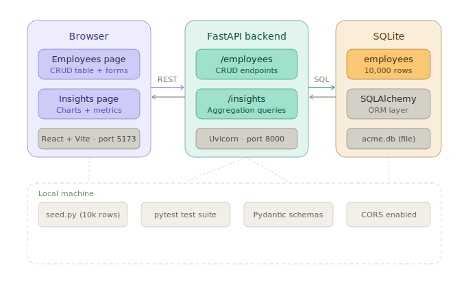

# ACME HR — Salary Management Tool

A web-based salary management tool for HR Managers to manage employee data and view salary insights across 10,000 employees and multiple countries.

---

## Architecture



The application follows a standard three-tier architecture, fully decoupled:

| Tier | Technology | Port |
|---|---|---|
| Frontend | React + Vite | 5173 |
| Backend | FastAPI (Python) | 8000 |
| Database | SQLite via SQLAlchemy | — (file) |

**Request flow:** Browser → REST API (JSON) → FastAPI routers → SQLAlchemy ORM → SQLite file (`acme.db`)

---

## Tradeoffs


---

## Performance Considerations


---

## Getting Started

### Prerequisites

- Python 3.10+
- Node.js 18+

### 1. Backend

```bash
cd api
uv run uvicorn main:app --reload --port 8000
```

API is live at **http://localhost:8000**
Interactive API docs at **http://localhost:8000/docs**

### 2. Seed the database

```bash
# With the venv still active, from the /api directory:
python seed.py
```

This inserts 10,000 employees using bulk insert. Runs in under 5 seconds.

### 3. Frontend

```bash
cd ui
npm install
npm run dev
```

UI is live at **http://localhost:5173**

---

## Running Tests

```bash
cd api
pytest tests/ -v
```

Tests run against an in-memory SQLite database — no setup, no state leakage, fully isolated.

---
